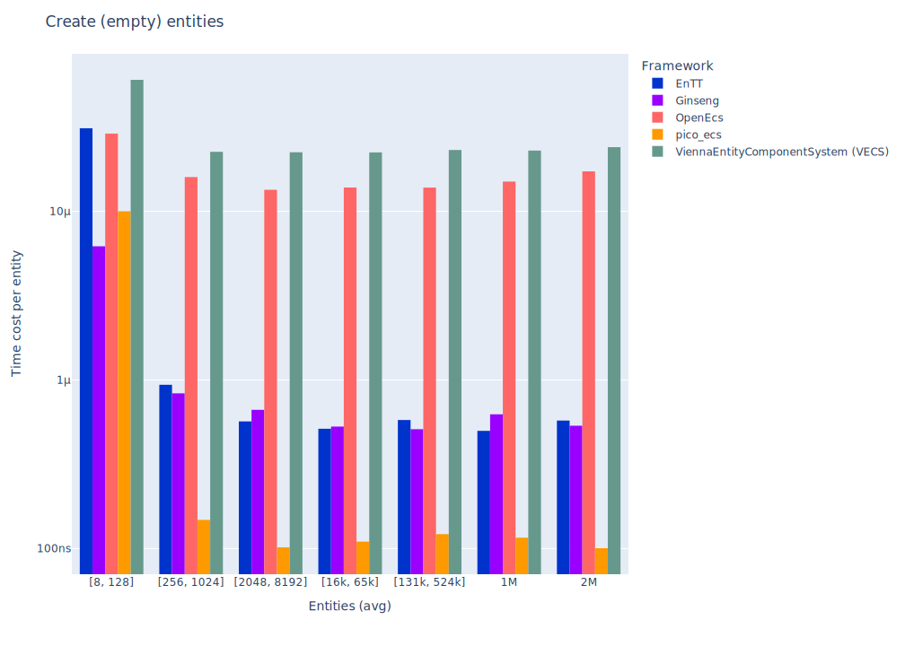

# Results

## TL;DR Results

_Graph shows cost per entity, tables shows total cost. lower is faster._

None

None

## Benchmarks

### Create No entities

_Graph shows cost per entity, tables shows total cost. lower is faster._

### Create empty entities

_Graph shows cost per entity, tables shows total cost. lower is faster._

|                               | EnTT   | Ginseng   | OpenEcs   | pico_ecs   | ViennaEntityComponentSystem (VECS)   |
|:------------------------------|:-------|:----------|:----------|:-----------|:-------------------------------------|
| Create   256 (empty) entities | 309us  | 276us     | 3538us    | 53us       | 5771us                               |
| Create   ~1K (empty) entities | 713us  | 649us     | 17165us   | 100us      | 23401us                              |
| Create   ~4K (empty) entities | 2261us | 2729us    | 52904us   | 416us      | 91580us                              |
| Create  ~16K (empty) entities | 8303us | 8311us    | 226813us  | 1521us     | 373761us                             |

|                               | EnTT   | Ginseng   | OpenEcs   | pico_ecs   | ViennaEntityComponentSystem (VECS)   |
|:------------------------------|:-------|:----------|:----------|:-----------|:-------------------------------------|
| Create  ~65K (empty) entities | 33ms   | 35ms      | 896ms     | 8ms        | 1431ms                               |
| Create  262K (empty) entities | 155ms  | 131ms     | 3652ms    | 31ms       | 5910ms                               |
| Create   ~1M (empty) entities | 523ms  | 655ms     | 15735ms   | 121ms      | 24027ms                              |
| Create   ~2M (empty) entities | 1204ms | 1121ms    | 36172ms   | 210ms      | 50341ms                              |

### Get No component from Entity

_Graph shows cost per entity, tables shows total cost. lower is faster._

|                                    | EnTT    | Ginseng   | OpenEcs   | pico_ecs   | ViennaEntityComponentSystem (VECS)   |
|:-----------------------------------|:--------|:----------|:----------|:-----------|:-------------------------------------|
| Get No component in   256 entities | 318us   | 35us      | 46us      | 0us        | 94us                                 |
| Get No component in   ~1K entities | 1214us  | 154us     | 201us     | 3us        | 372us                                |
| Get No component in   ~4K entities | 5707us  | 605us     | 712us     | 13us       | 1527us                               |
| Get No component in  ~16K entities | 18975us | 2315us    | 2649us    | 53us       | 6101us                               |

|                                    | EnTT   | Ginseng   | OpenEcs   | pico_ecs   | ViennaEntityComponentSystem (VECS)   |
|:-----------------------------------|:-------|:----------|:----------|:-----------|:-------------------------------------|
| Get No component in  ~65K entities | 72ms   | 9ms       | 11ms      | 0ms        | 24ms                                 |
| Get No component in  262K entities | 337ms  | 39ms      | 32ms      | 0ms        | 97ms                                 |
| Get No component in   ~1M entities | 1338ms | 134ms     | 112ms     | 3ms        | 383ms                                |
| Get No component in   ~2M entities | 2790ms | 287ms     | 216ms     | 6ms        | 798ms                                |

### Create entities

_Graph shows cost per entity, tables shows total cost. lower is faster._

|                                           | EnTT     | Ginseng   | OpenEcs   | pico_ecs   | ViennaEntityComponentSystem (VECS)   |
|:------------------------------------------|:---------|:----------|:----------|:-----------|:-------------------------------------|
| Create   256 entities with two Components | 2883us   | 3001us    | 667us     | 95us       | 8225us                               |
| Create   ~1K entities with two Components | 9970us   | 3992us    | 2105us    | 273us      | 30985us                              |
| Create   ~4K entities with two Components | 34679us  | 10649us   | 7477us    | 1101us     | 127054us                             |
| Create  ~16K entities with two Components | 140345us | 30319us   | 28933us   | 4169us     | 481434us                             |

|                                           | EnTT    | Ginseng   | OpenEcs   | pico_ecs   | ViennaEntityComponentSystem (VECS)   |
|:------------------------------------------|:--------|:----------|:----------|:-----------|:-------------------------------------|
| Create  ~65K entities with two Components | 562ms   | 112ms     | 116ms     | 20ms       | 1943ms                               |
| Create  262K entities with two Components | 2185ms  | 563ms     | 501ms     | 77ms       | 7870ms                               |
| Create   ~1M entities with two Components | 9688ms  | 1820ms    | 1891ms    | 302ms      | 31858ms                              |
| Create   ~2M entities with two Components | 16324ms | 3757ms    | 3932ms    | 575ms      | 67865ms                              |

### Get one (non-const) component from Entity

_Graph shows cost per entity, tables shows total cost. lower is faster._

|                                        | EnTT    | Ginseng   | OpenEcs   | pico_ecs   | ViennaEntityComponentSystem (VECS)   |
|:---------------------------------------|:--------|:----------|:----------|:-----------|:-------------------------------------|
| Unpack one component in   256 entities | 892us   | 42us      | 50us      | 14us       | 388us                                |
| Unpack one component in   ~1K entities | 3471us  | 150us     | 202us     | 54us       | 1533us                               |
| Unpack one component in   ~4K entities | 12614us | 606us     | 794us     | 198us      | 6223us                               |
| Unpack one component in  ~16K entities | 49971us | 2583us    | 3205us    | 837us      | 24403us                              |

|                                        | EnTT   | Ginseng   | OpenEcs   | pico_ecs   | ViennaEntityComponentSystem (VECS)   |
|:---------------------------------------|:-------|:----------|:----------|:-----------|:-------------------------------------|
| Unpack one component in  ~65K entities | 204ms  | 10ms      | 12ms      | 3ms        | 96ms                                 |
| Unpack one component in  262K entities | 944ms  | 37ms      | 52ms      | 14ms       | 385ms                                |
| Unpack one component in   ~1M entities | 3494ms | 167ms     | 198ms     | 61ms       | 1624ms                               |
| Unpack one component in   ~2M entities | 6626ms | 341ms     | 460ms     | 109ms      | 3494ms                               |

### Get two components from entity

_Graph shows cost per entity, tables shows total cost. lower is faster._

|                                         | EnTT    | Ginseng   | OpenEcs   | pico_ecs   | ViennaEntityComponentSystem (VECS)   |
|:----------------------------------------|:--------|:----------|:----------|:-----------|:-------------------------------------|
| Unpack two components in   256 entities | 1634us  | 74us      | 91us      | 25us       | 810us                                |
| Unpack two components in   ~1K entities | 7873us  | 322us     | 351us     | 100us      | 3226us                               |
| Unpack two components in   ~4K entities | 30275us | 1110us    | 1411us    | 453us      | 12993us                              |
| Unpack two components in  ~16K entities | 95052us | 5288us    | 5788us    | 1819us     | 51254us                              |

|                                         | EnTT    | Ginseng   | OpenEcs   | pico_ecs   | ViennaEntityComponentSystem (VECS)   |
|:----------------------------------------|:--------|:----------|:----------|:-----------|:-------------------------------------|
| Unpack two components in  ~65K entities | 348ms   | 16ms      | 22ms      | 7ms        | 201ms                                |
| Unpack two components in  262K entities | 1778ms  | 75ms      | 90ms      | 26ms       | 777ms                                |
| Unpack two components in   ~1M entities | 5107ms  | 315ms     | 361ms     | 108ms      | 3120ms                               |
| Unpack two components in   ~2M entities | 11511ms | 572ms     | 788ms     | 219ms      | 6689ms                               |

### Get three components from entity

_Graph shows cost per entity, tables shows total cost. lower is faster._

|                                           | EnTT    | Ginseng   | OpenEcs   | pico_ecs   | ViennaEntityComponentSystem (VECS)   |
|:------------------------------------------|:--------|:----------|:----------|:-----------|:-------------------------------------|
| Unpack three components in   512 entities | 4249us  | 275us     | 325us     | 85us       | 2070us                               |
| Unpack three components in   ~2K entities | 15384us | 1078us    | 1311us    | 329us      | 8418us                               |
| Unpack three components in   ~8K entities | 68153us | 4804us    | 5404us    | 1366us     | 33724us                              |

|                                           | EnTT   | Ginseng   | OpenEcs   | pico_ecs   | ViennaEntityComponentSystem (VECS)   |
|:------------------------------------------|:-------|:----------|:----------|:-----------|:-------------------------------------|
| Unpack three components in  ~32K entities | 245ms  | 19ms      | 21ms      | 5ms        | 127ms                                |
| Unpack three components in  131K entities | 1043ms | 62ms      | 91ms      | 22ms       | 468ms                                |
| Unpack three components in  524K entities | 4848ms | 251ms     | 381ms     | 92ms       | 1875ms                               |
| Unpack three components in   ~1M entities | 8677ms | 488ms     | 888ms     | 187ms      | 4010ms                               |

### Add component

_Graph shows cost per entity, tables shows total cost. lower is faster._

|                                   | EnTT    | Ginseng   | OpenEcs   | pico_ecs   | ViennaEntityComponentSystem (VECS)   |
|:----------------------------------|:--------|:----------|:----------|:-----------|:-------------------------------------|
| Add a Component in   256 entities | 1099us  | 354us     | 396us     | 169us      | 10743us                              |
| Add a Component in   ~1K entities | 4248us  | 1247us    | 1266us    | 680us      | 42301us                              |
| Add a Component in   ~4K entities | 16480us | 4520us    | 4023us    | 2912us     | 166669us                             |
| Add a Component in  ~16K entities | 65418us | 18594us   | 17609us   | 13038us    | 663077us                             |

|                                   | EnTT   | Ginseng   | OpenEcs   | pico_ecs   | ViennaEntityComponentSystem (VECS)   |
|:----------------------------------|:-------|:----------|:----------|:-----------|:-------------------------------------|
| Add a Component in  ~65K entities | 270ms  | 72ms      | 69ms      | 50ms       | 2664ms                               |
| Add a Component in  262K entities | 1055ms | 320ms     | 278ms     | 196ms      | 10408ms                              |
| Add a Component in   ~1M entities | 4796ms | 1372ms    | 1116ms    | 721ms      | 45874ms                              |
| Add a Component in   ~2M entities | 9600ms | 2796ms    | 1965ms    | 1399ms     | 87891ms                              |

### Remove and add component

_Graph shows cost per entity, tables shows total cost. lower is faster._

|                                              | EnTT     | Ginseng   | OpenEcs   | pico_ecs   | ViennaEntityComponentSystem (VECS)   |
|:---------------------------------------------|:---------|:----------|:----------|:-----------|:-------------------------------------|
| Remove and Add a Component in   256 entities | 1754us   | 185us     | 130us     | 36us       | 19455us                              |
| Remove and Add a Component in   ~1K entities | 7356us   | 720us     | 547us     | 148us      | 78390us                              |
| Remove and Add a Component in   ~4K entities | 28551us  | 2832us    | 2044us    | 725us      | 317871us                             |
| Remove and Add a Component in  ~16K entities | 109551us | 11217us   | 8444us    | 2366us     | 1206984us                            |

|                                              | EnTT    | Ginseng   | OpenEcs   | pico_ecs   | ViennaEntityComponentSystem (VECS)   |
|:---------------------------------------------|:--------|:----------|:----------|:-----------|:-------------------------------------|
| Remove and Add a Component in  ~65K entities | 549ms   | 43ms      | 34ms      | 10ms       | 4964ms                               |
| Remove and Add a Component in  262K entities | 1775ms  | 220ms     | 139ms     | 38ms       | 20048ms                              |
| Remove and Add a Component in   ~1M entities | 7196ms  | 712ms     | 587ms     | 158ms      | 82721ms                              |
| Remove and Add a Component in   ~2M entities | 15028ms | 1299ms    | 1164ms    | 315ms      | 167513ms                             |

### Destroy entities

_Graph shows cost per entity, tables shows total cost. lower is faster._

|                                            | EnTT    | Ginseng   | OpenEcs   | pico_ecs   | ViennaEntityComponentSystem (VECS)   |
|:-------------------------------------------|:--------|:----------|:----------|:-----------|:-------------------------------------|
| Destroy   256 entities with two components | 1587us  | 2216us    | 405us     | 79us       | 498us                                |
| Destroy   ~1K entities with two components | 5709us  | 6499us    | 1119us    | 156us      | 2190us                               |
| Destroy   ~4K entities with two components | 24353us | 24723us   | 3919us    | 516us      | 5670us                               |
| Destroy  ~16K entities with two components | 97365us | 95804us   | 14855us   | 1940us     | 25549us                              |

|                                            | EnTT   | Ginseng   | OpenEcs   | pico_ecs   | ViennaEntityComponentSystem (VECS)   |
|:-------------------------------------------|:-------|:----------|:----------|:-----------|:-------------------------------------|
| Destroy  ~65K entities with two components | 312ms  | 408ms     | 59ms      | 10ms       | 88ms                                 |
| Destroy  262K entities with two components | 1276ms | 1511ms    | 297ms     | 34ms       | 368ms                                |
| Destroy   ~1M entities with two components | 4965ms | 6517ms    | 919ms     | 151ms      | 1488ms                               |
| Destroy   ~2M entities with two components | 8435ms | 15838ms   | 1854ms    | 317ms      | 2961ms                               |

### Create entities at once

_Graph shows cost per entity, tables shows total cost. lower is faster._

|                                                   | EnTT    | OpenEcs   | ViennaEntityComponentSystem (VECS)   |
|:--------------------------------------------------|:--------|:----------|:-------------------------------------|
| Create   256 entities with two components at once | 1009us  | 551us     | 8021us                               |
| Create   ~1K entities with two components at once | 2426us  | 1613us    | 31295us                              |
| Create   ~4K entities with two components at once | 7545us  | 5360us    | 124564us                             |
| Create  ~16K entities with two components at once | 30163us | 21237us   | 507604us                             |

|                                                   | EnTT   | OpenEcs   | ViennaEntityComponentSystem (VECS)   |
|:--------------------------------------------------|:-------|:----------|:-------------------------------------|
| Create  ~65K entities with two components at once | 110ms  | 80ms      | 2064ms                               |
| Create  262K entities with two components at once | 460ms  | 316ms     | 7928ms                               |
| Create   ~1M entities with two components at once | 1748ms | 1267ms    | 32159ms                              |
| Create   ~2M entities with two components at once | 3508ms | 2682ms    | 69911ms                              |

### Create empty entities at once

_Graph shows cost per entity, tables shows total cost. lower is faster._

|                                       | EnTT   | OpenEcs   | ViennaEntityComponentSystem (VECS)   |
|:--------------------------------------|:-------|:----------|:-------------------------------------|
| Create   256 (empty) entities at once | 359us  | 178us     | 6555us                               |
| Create   ~1K (empty) entities at once | 750us  | 418us     | 24737us                              |
| Create   ~4K (empty) entities at once | 2346us | 1016us    | 99973us                              |
| Create  ~16K (empty) entities at once | 9201us | 3524us    | 391625us                             |

|                                       | EnTT   | OpenEcs   | ViennaEntityComponentSystem (VECS)   |
|:--------------------------------------|:-------|:----------|:-------------------------------------|
| Create  ~65K (empty) entities at once | 36ms   | 13ms      | 1569ms                               |
| Create  262K (empty) entities at once | 147ms  | 49ms      | 6200ms                               |
| Create   ~1M (empty) entities at once | 580ms  | 203ms     | 24886ms                              |
| Create   ~2M (empty) entities at once | 1179ms | 397ms     | 50147ms                              |

### Destroy entities at once

_Graph shows cost per entity, tables shows total cost. lower is faster._

|                                                    | EnTT    |
|:---------------------------------------------------|:--------|
| Destroy   256 entities with two components at once | 668us   |
| Destroy   ~1K entities with two components at once | 2241us  |
| Destroy   ~4K entities with two components at once | 9272us  |
| Destroy  ~16K entities with two components at once | 32657us |

|                                                    | EnTT   |
|:---------------------------------------------------|:-------|
| Destroy  ~65K entities with two components at once | 127ms  |
| Destroy  262K entities with two components at once | 496ms  |
| Destroy   ~1M entities with two components at once | 1947ms |
| Destroy   ~2M entities with two components at once | 3781ms |

### Candidates

#### EntityX by @alecthomas 

> Entity Component Systems (ECS) are a form of decomposition that completely decouples entity logic and data from the entity "objects" themselves. The Evolve your Hierarchy article provides a solid overview of EC systems and why you should use them.

Version: 1.1.2 (Apr 2023)

#### EnTT by @skypjack 

> EnTT is a header-only, tiny and easy to use library for game programming and much more written in modern C++.

Version: v3.13.2

#### Ginseng by @apples 

> Ginseng is an entity-component-system (ECS) library designed for use in games.

The main advantage over similar libraries is that the component types do not need to be listed or registered. Component types are detected dynamically.

Any function-like object can be used as a system. The function's parameters are used to determine the required components.

Version: 1.1 (Dec 2021)

#### mustache by @kirillochnev 

> A fast, modern C++ Entity Component System

Version: 0.2 (Feb 2024)

#### OpenEcs by @Gronis 

> Open Ecs is an Entity Component System that uses metaprogramming, cache coherency, and other useful tricks to maximize performance and configurability. It is written in c++11 without further dependencies.

Version: 0.1.101 (Apr 2017)

#### Flecs by @SanderMertens 

> Flecs is a fast and lightweight Entity Component System that lets you build games and simulations with millions of entities.

Version: v4.0.1

#### pico_ecs by @empyreanx 

> A collection of cross-platform single header libraries written in C. Pure and simple ECS.

Version: 2.3 (Sep 2023)

#### gaia-ecs by @richardbiely 

> Gaia-ECS is a fast and easy-to-use ECS framework.

Version: v0.8.6

#### ViennaEntityComponentSystem (VECS) by @hlavacshelmut 

> The Vienna Entity Component System (VECS) is a C++20 based ECS for game engines.

Version: 0.1

### Environment

- **OS:** Windows
- **CPU:** 2.11GHz @ 8Cores
- **RAM:** 15.78GB

